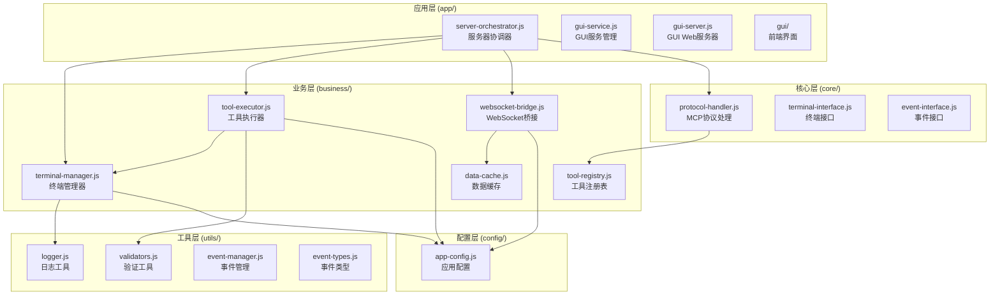
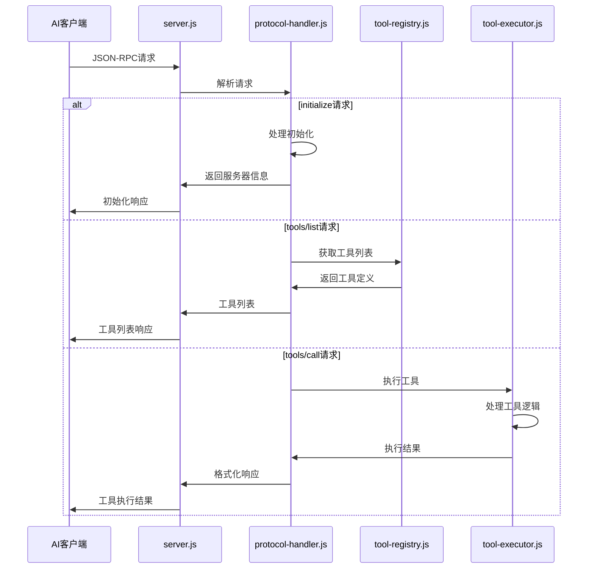
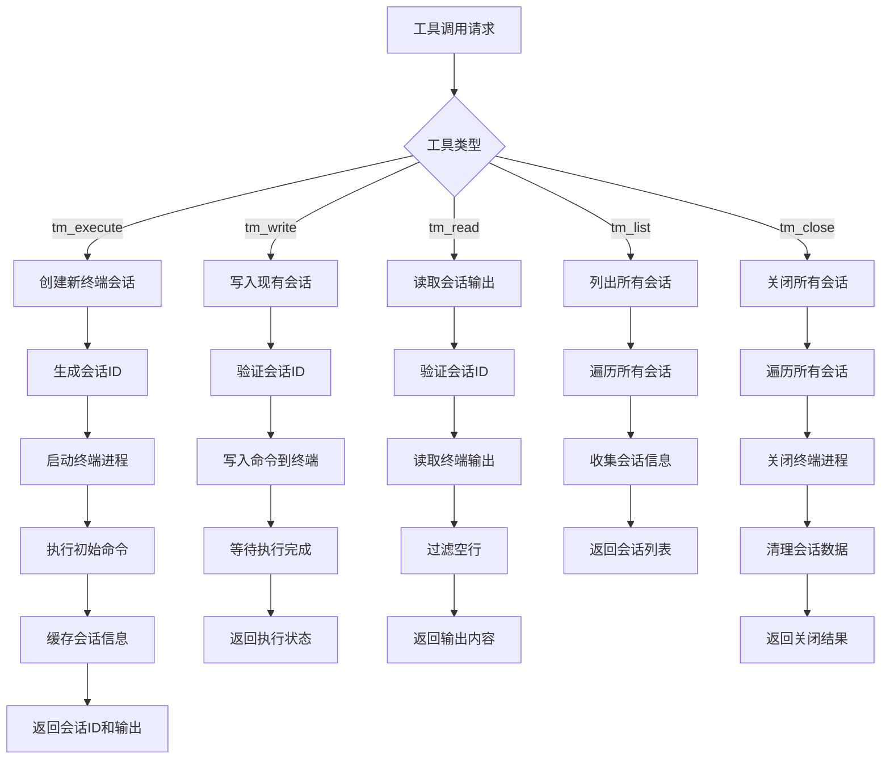
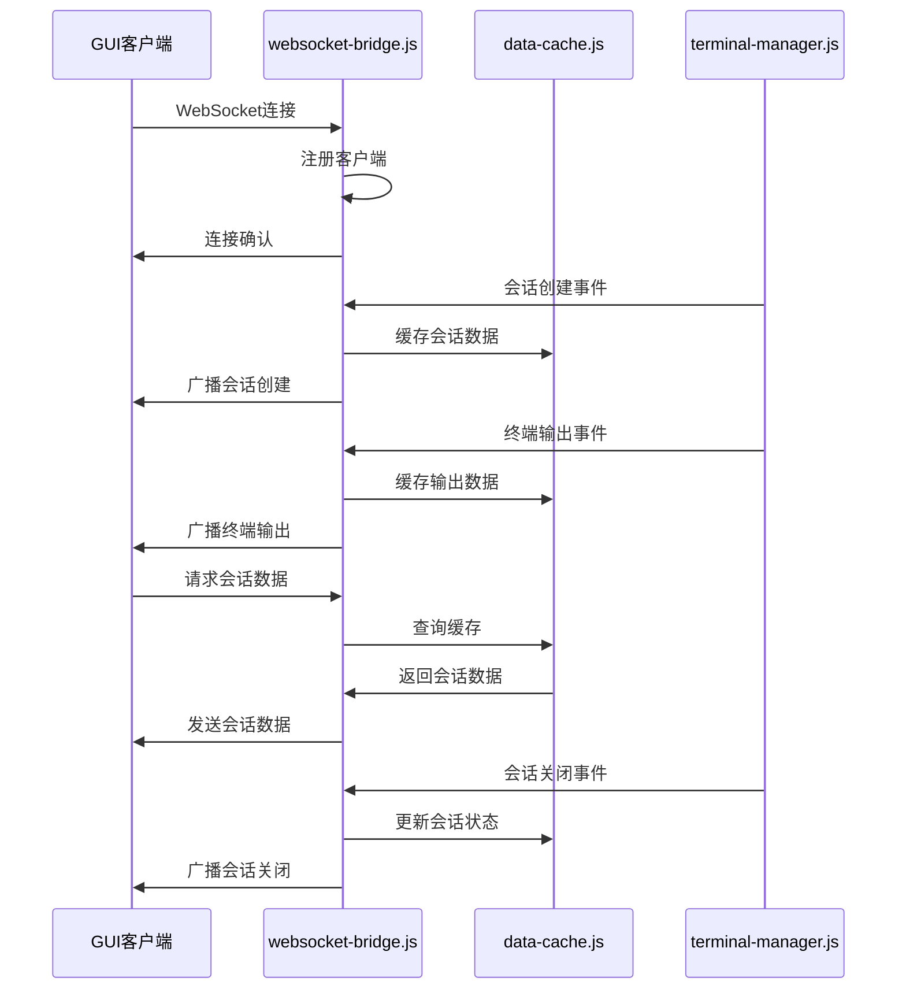
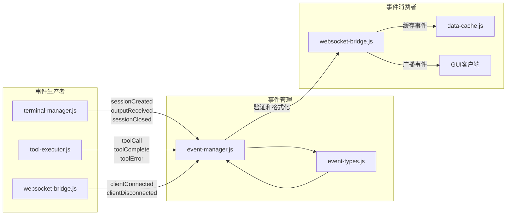
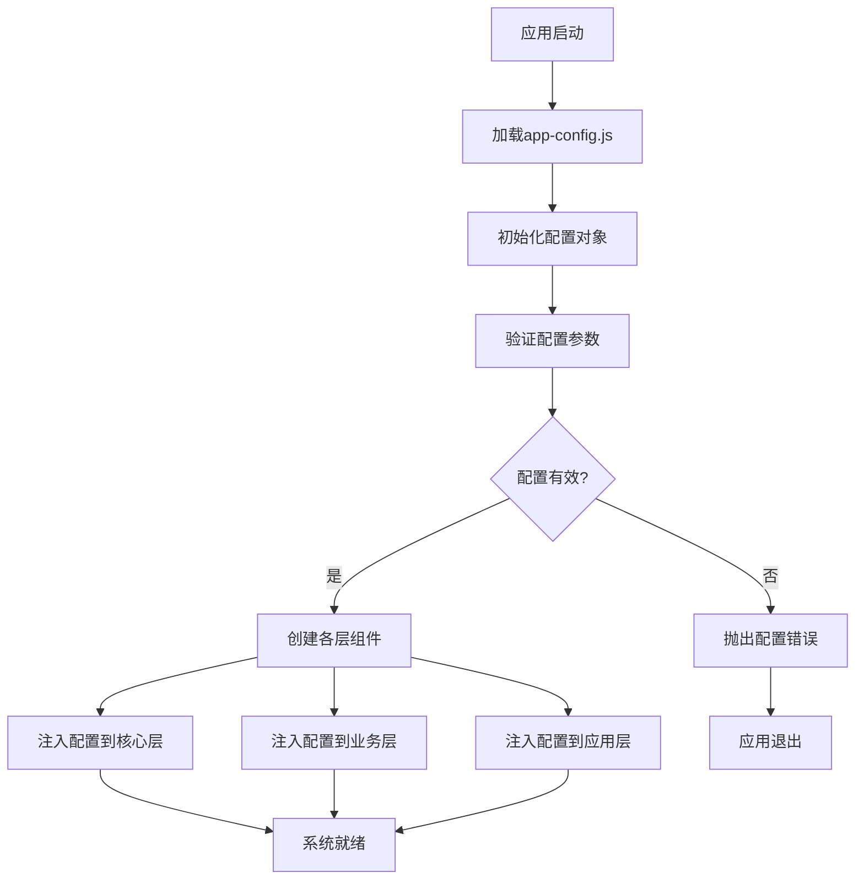
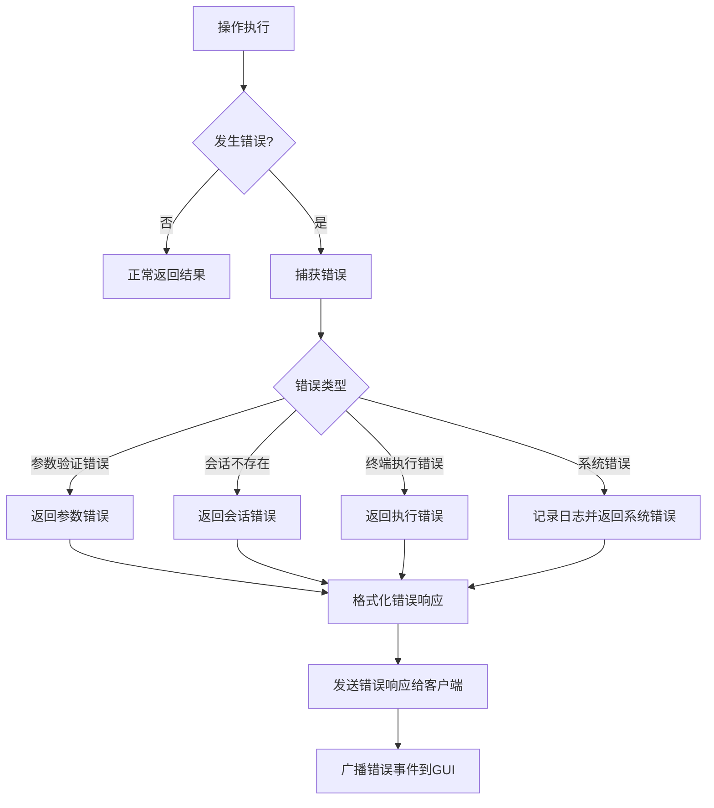
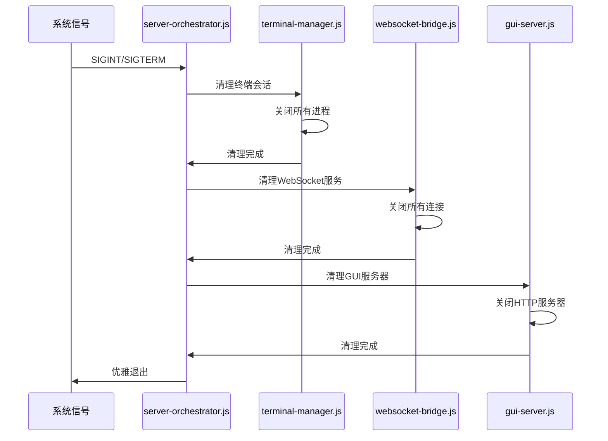

# MCP Terminal Server 业务逻辑文档

本文档使用Mermaid图表详细描述MCP Terminal Server的核心业务逻辑流程。

## 1. 系统架构概览

## 2. MCP协议处理流程

## 3. 终端管理业务流程

## 4. WebSocket通信流程

## 5. 事件系统流程

## 6. 配置管理流程

## 7. 错误处理流程

## 8. 资源清理流程

---

以上图表展示了MCP Terminal Server的核心业务逻辑流程，涵盖了从请求处理到资源清理的完整生命周期。
